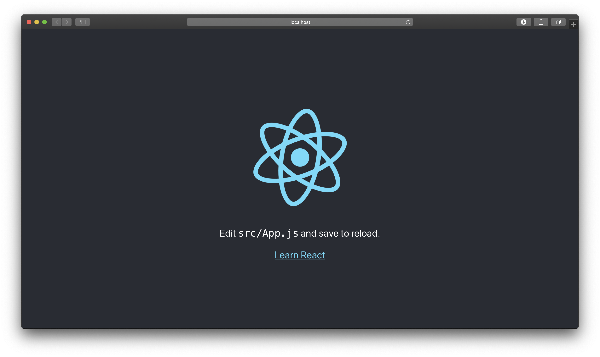
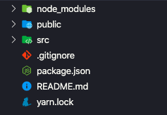

Hello World
===

Hello React!
---

`리액트 (React)` 란 무엇일까요? 리액트는 페이스북에서 개발한 JavaScript UI 라이브러리입니다. 리액트는 현재 가장 주목받고 있는 JavaScript 라이브러리 중 하나로, 많은 유명 기업에서 사용되고 있습니다. 

리액트는 기존 JavaScript 개발에서 발생하던 문제를 크게 줄일 수 있어 차세대 개발 기술이라고 할 수 있습니다. 페이스북은 리액트를 오픈 소스로 출시 하여 활발하게 개발이 진행되게 하였고, 이에 따라 리액트는 나날히 발전해 나가고 있습니다. 또한 세계적으로도 무척 관심을 많이 받는 기술로 알아둘 가치가 있습니다.

이번 교안에서는 리액트의 특징과 개발환경에 대해 알아보고 실제로 간단한 예제를 통해 리액트를 접해보도록 하겠습니다.

리액트의 특징
---

[리액트 공식 홈페이지](https://ko.reactjs.org) 에서는 리액트의 특징을 다음과 같이 설명하고 있습니다.

### 선언형

> React는 상호작용이 많은 UI를 만들 때 생기는 어려움을 줄여줍니다. 애플리케이션의 각 상태에 대한 간단한 뷰만 설계하세요. 그럼 React는 데이터가 변경됨에 따라 적절한 컴포넌트만 효율적으로 갱신하고 렌더링합니다. 

> 선언형 뷰는 코드를 예측 가능하고 디버그하기 쉽게 만들어 줍니다.

### 컴포넌트 기반

> 스스로 상태를 관리하는 캡슐화된 컴포넌트를 만드세요. 그리고 이를 조합해 복잡한 UI를 만들어보세요.

> 컴포넌트 로직은 템플릿이 아닌 JavaScript로 작성됩니다. 따라서 다양한 형식의 데이터를 앱 안에서 손쉽게 전달할 수 있고, DOM과는 별개로 상태를 관리할 수 있습니다.

### 한 번 배워서 어디서나 사용하기

> 기술 스택의 나머지 부분에는 관여하지 않기 때문에, 기존 코드를 다시 작성하지 않고도 React의 새로운 기능을 이용해 개발할 수 있습니다.

> React는 Node 서버에서 렌더링을 할 수도 있고, React Native를 이용하면 모바일 앱도 만들 수 있습니다.

개발환경 준비
---

리액트 개발에 필요한 개발환경은 아래와 같습니다.

- `Node.js`
  - 서버에서 JavaScript를 실행할 수 있는 환경입니다. 
  - Node 등의 언어를 위한 패키지 등록 도구인 `NPM` 을 지원하며, Node 설치 프로그램에서 NPM 클라이언트를 함께 제공하므로 쉽게 패키지를 설치할 수 있습니다.
  - [Node.js 공식 홈페이지](https://nodejs.org/en/)에서 좌측의 LTS 버전으로 설치해주세요.

- `Yarn` (선택사항)
  - [Yarn 공식 홈페이지](https://yarnpkg.com/en/docs/install)에서 설치해주세요.

- `VSCode` 등의 코드 에디터
  - 코드 에디터는 [VS Code](https://code.visualstudio.com/) 등 자유롭게 선택하여 설치해주세요.
 
- `Git Bash`
  - Windows 를 사용하는 분은 [Git for Windows 공식 홈페이지](https://gitforwindows.org)에서 기본 옵션으로 설치해주세요. Windows 가 아니라면 설치하지 않으셔도 됩니다.

위의 개발환경이 준비가 되었다면 `create-react-app`을 설치해 보도록 하겠습니다. create-react-app은 리액트 개발 환경 설정들을 보다 손쉽게 하기 위해서 페이스북에서 만든 패키지입니다. 우리는 이 패키지를 통해 리액트 개발을 진행해 볼 예정입니다. 

설치는 전역 노드 패키지에 진행하도록 하겠습니다.

~~~bash
npm install -g create-react-app
~~~

프로젝트 생성
---

리액트 프로젝트를 생성하기 위해서는 아래와 같이 명령어를 실행합니다.

~~~bash
create-react-app [프로젝트명]
~~~

이번 교안에서는 `the-road-to-learn-react-likelion` 이라는 프로젝트를 생성해보겠습니다.

~~~bash
create-react-app the-road-to-learn-react-likelion
~~~

프로젝트가 생성되었으면 해당 디렉토리 내부로 이동 후, `yarn start` (또는 `npm start`) 명령어를 실행해보세요.

~~~bash
cd react-app
yarn start
~~~

실행을 하게 되면 [http://localhost:3000](http://localhost:3000) 에 create-react-app 초기 화면이 나타나게 됩니다. 이제 리액트를 시작할 준비를 다 마쳤습니다.

리액트 구조
---

리액트 프로젝트 디렉토리 내부를 살펴봅시다. 다음은 `create-react-app` 을 통해 생성한 프로젝트 디렉토리의 모습입니다.

먼저, `node_modules` 폴더에는 프로젝트에 필요한 Node.js 의 모듈이 설치됩니다.  새로운 모듈을 설치하고 싶을 때는 아래의 명령어를 실행하면 됩니다.

~~~bash
npm install [모듈 이름]
~~~

다음으로, `public` 폴더의 [index.html](public/index.html) 에는 우리가 마주하는 리액트 프로젝트의 root 태그가 있습니다. 리액트는 기본적으로 SPA(Single Page Application)를 만족하는데, 각 페이지의 기본적인 틀이 바로 이 [index.html](public/index.html) 입니다. 코드를 자세히 살펴봅시다.

~~~html

~~~

id 의 값이 <strong>root</strong> 인 div 태그는 리액트 DOM이 렌더링 되는 태그입니다. 렌더링 된 화면이 우리가 보는 리액트의 화면이 되는 것입니다.

다음으로, `src` 폴더를 살펴봅시다. 먼저 [index.js](src/index.js)는 앞서 살펴본 [index.html](public/index.html)에 리액트 DOM을 렌더링 시키는 코드입니다. 

~~~jsx
const element = <h1>Hello, world!</h1>;
ReactDOM.render(element, document.getElementById('root'));
~~~

위의 코드는 h2 태그를 id 의 값이 <strong>root</strong> 인 태그에 렌더링 하라는 것입니다. 여기서 JavaScript 코드에 HTML 태그를 써도 되나 라는 의문이 들 수도 있습니다. 이것은 바로 페이스북에서 개발한 `JSX` 라는 JavaScript 확장 문법입니다. JSX 문법에 따라, 여기서  h2 태그의 내용은 엘리먼트라고 불리는 리액트 앱의 가장 작은 단위가 됩니다. 위 코드를 실행하면 화면에 "Hello, world!"가 보일 겁니다. 

리액트의 엘리먼트는 불변객체입니다. 엘리먼트를 생성한 이후에는 해당 엘리먼트의 자식이나 속성을 변경할 수 없습니다. 엘리먼트는 영화에서 하나의 프레임과 같이 특정 시점의 UI를 보여줍니다.

지금까지 소개한 내용을 바탕으로 하면 UI를 업데이트하는 유일한 방법은 새로운 엘리먼트를 생성하고 이를 `ReactDOM.render()`로 전달하는 것입니다. 아래의 코드를 살펴봅시다.

~~~jsx
const tick = () => {
  const element = (
    

      <h1>Hello, world!</h1>
      <h2>It is {new Date().toLocaleTimeString()}.</h2>
    

  );
  ReactDOM.render(element, document.getElementById('root'));
}

setInterval(tick, 1000);
~~~

위의 코드에서는 `setInterval()` 콜백을 이용해 초마다 `ReactDOM.render()`를 호출합니다. 리액트 DOM은 해당 엘리먼트와 그 자식 엘리먼트를 이전의 엘리먼트와 비교하고 DOM을 원하는 상태로 만드는데 필요한 경우에만 DOM을 업데이트합니다.

매초 전체 UI를 다시 그리도록 엘리먼트를 만들었지만 React DOM은 내용이 변경된 텍스트 노드만 업데이트했습니다.

~~~jsx
ReactDOM.render(<App />, document.getElementById('root'));
~~~

위의 코드는 `<App />` 이라는 태그를 렌더링하라는 것이겠지요? 하지만 우리가 아는 HTML 태그 중에는 없는 태그입니다. 또한 위에서 살펴본 앨리면트와는 다른 개념입니다. 이러한 것은 바로 <strong>컴포넌트</strong>라고 불리는 것 입니다. 컴포넌트에 대해서는 다음 교안에서 더 자세하게 다루어 보도록 하겠습니다.

마지막으로, 남은 파일들을 살펴봅시다. 먼저 `.gitignore`는 Github에 올리지 않을 파일이나 폴더의 목록을 적는 파일입니다. create-react-app을 통해 생성된 리액트 프로젝트는 자동으로 gitignore 항목이 작성됩니다. `package.json` 과 `yarn.lock`은 각각 설치된 NPM 패키지 목록과 Yarn 패키지 목록이 작성됩니다. 이 파일들은 패키지 설치시 자동으로 업데이트 됩니다.

마무리
---

이번 교안에서는 리액트의 특징과 개발환경에 대해 알아보고 실제로 간단한 예제를 통해 리액트를 접해보았습니다. 다음 교안에서는 리액트의 핵심인 <strong>컴포넌트</strong> 와 <strong>props</strong> 에 대해서 알아보도록 하겠습니다.
